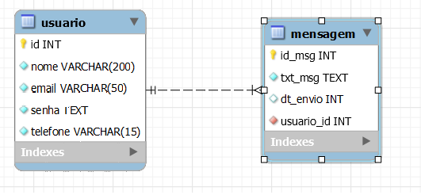

# Projeto DablioW - Relatório Final

## Introdução

A solução proposta para o problema consiste em uma aplicação de rede social chamada DablioW, desenvolvida em Java com o framework Spring Boot. O sistema utiliza um banco de dados MySQL para armazenar informações de usuários e mensagens trocadas entre eles. A estrutura do projeto é projetada para ser escalável e compatível com um número indefinido de entradas.

## Estrutura de Dados

A estrutura de dados do projeto inclui as classes `Usuario` e `Mensagem`, mapeadas para as tabelas correspondentes no banco de dados. A utilização do Spring Data JPA simplifica a interação com o banco de dados, proporcionando uma camada de abstração eficiente.

### UML - Diagrama de Classe

O diagrama de classe representa a estrutura do projeto, destacando as principais entidades, seus atributos e relacionamentos. A classe abstrata `Usuario` é estendida pela classe concreta `Mensagem`, demonstrando o uso de herança.

## Desenvolvimento

### Funcionamento dos Principais Métodos

#### Classe `UsuarioController`

A classe `UsuarioController` é responsável por manipular as operações relacionadas a usuários. Os principais métodos incluem:

- `listaUsuarios()`: Retorna a lista de todos os usuários cadastrados.
- `criarUsuario(usuario)`: Cria e salva um novo usuário no banco de dados.
- `editarUsuario(usuario)`: Edita e salva as informações de um usuário existente.
- `excluirUsuario(id)`: Exclui um usuário com base no ID fornecido.
- `login(usuario)`: Realiza a autenticação do usuário.

#### Classe `MensagemController`

A classe `MensagemController` trata das operações relacionadas a mensagens. Os métodos principais incluem:

- `listarMensagens()`: Retorna a lista de todas as mensagens.
- `salvarMensagem(mensagem)`: Salva uma nova mensagem no banco de dados.

### Utilização de Conceitos POO

- **Classe Abstrata (`Usuario`):** A classe abstrata `Usuario` fornece uma estrutura base para entidades específicas de usuário. Ela encapsula características comuns, como nome, e-mail, senha e telefone.

- **Herança (`Mensagem`):** A classe `Mensagem` herda da classe `Usuario`, representando uma mensagem enviada por um usuário específico. A herança permite reutilizar atributos e métodos da classe pai.

- **Interface (`IMensagem`):** A interface `IMensagem` define métodos que devem ser implementados pelas classes que desejam realizar operações com mensagens. Isso promove o polimorfismo, permitindo que diferentes classes de mensagem usem a mesma interface.

## Padrões de Projeto

O projeto utiliza padrões de projeto para promover uma arquitetura mais limpa e eficiente:

- **Padrão MVC (Model-View-Controller):** As classes de modelo (`Usuario` e `Mensagem`), controlador (`UsuarioController` e `MensagemController`), e visão (interfaces gráficas) são claramente separadas, promovendo a modularidade e a manutenção do código.

- **Padrão Repository:** As interfaces `UsuarioRepository` e `IMensagem` implementam o padrão repository do Spring Data JPA, simplificando as operações de banco de dados.

## Banco de Dados

O banco de dados MySQL é utilizado para armazenar informações de usuários e mensagens. A estrutura do banco de dados é definida pelas classes de modelo (`Usuario` e `Mensagem`), proporcionando consistência e integridade de dados.

## Interface Gráfica

A interface gráfica do DablioW é desenvolvida em HTML, CSS e JavaScript, proporcionando uma experiência de usuário interativa. As telas de cadastro, login e mensagens são implementadas com uma abordagem amigável e responsiva.

## Conclusão

O desenvolvimento do projeto DablioW trouxe desafios significativos, mas também ofereceu oportunidades de aprendizado valiosas. As principais dificuldades incluíram [Aplicação do Banco de dados com o Front-End, e aplicação da API]. No entanto, as conquistas alcançadas confirmam o sucesso geral do projeto.
